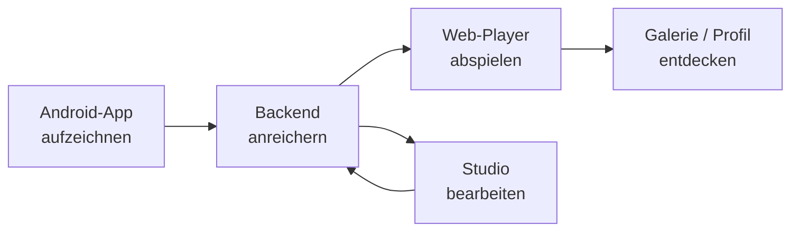
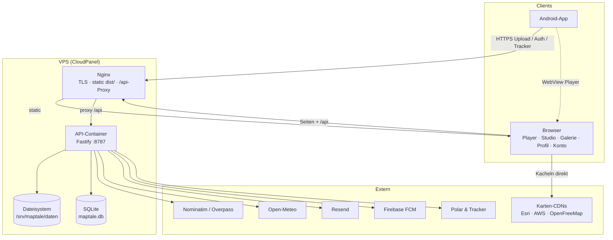
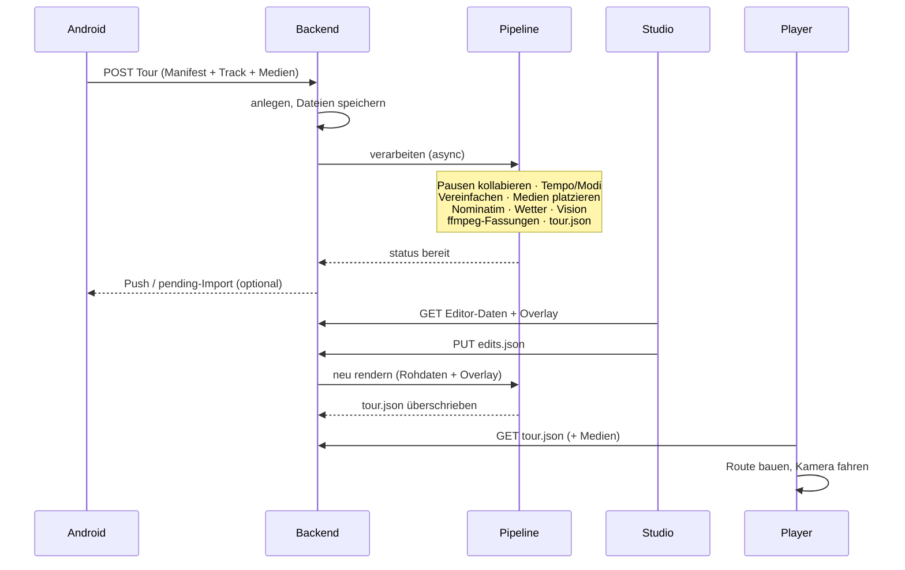
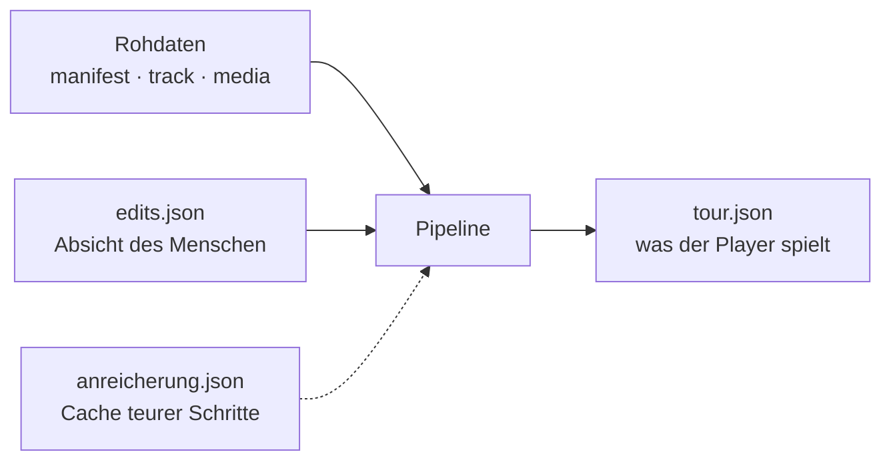
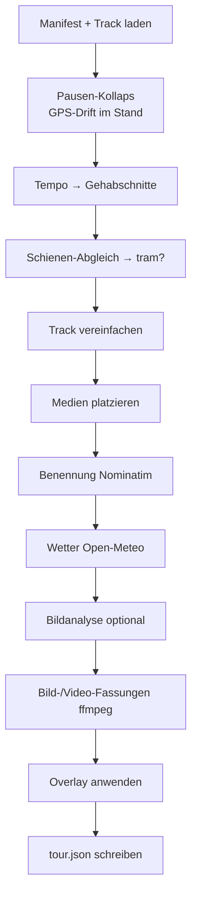
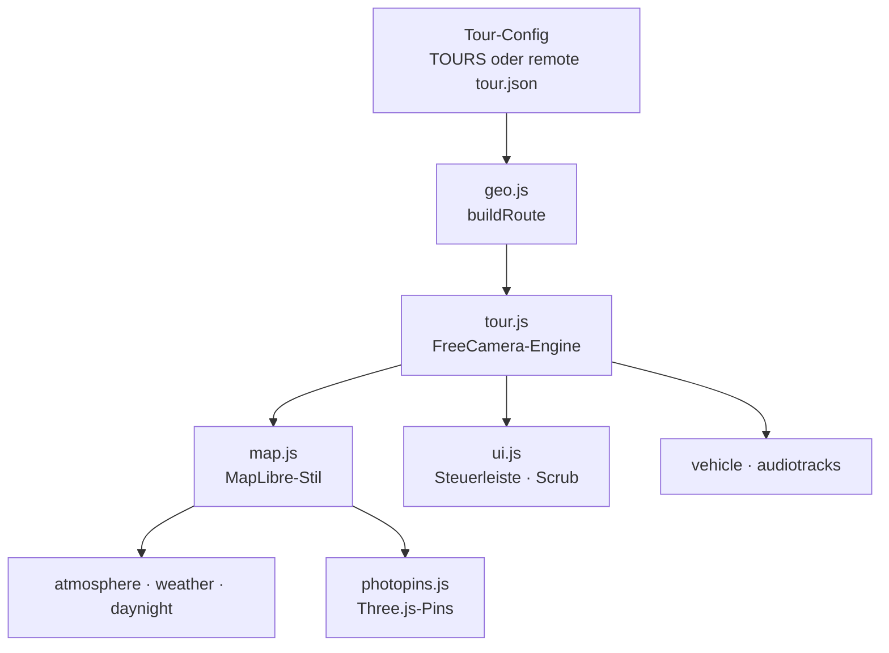
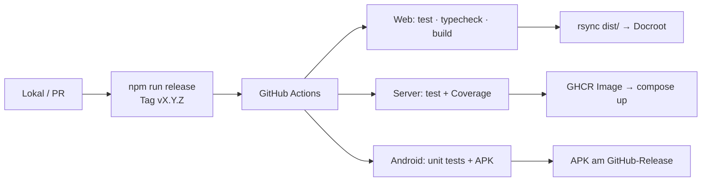

# Maptale — Tech-Stack & Systemarchitektur

Stand: August 2026 · High-Level-Überblick über das Monorepo. Detailentscheidungen
stehen in den verlinkten Docs unter `architecture/`, `specs/` und `ops/`.

Maptale erzeugt Relive-artige 3D-Kamerafahrten über GPS-Routen mit automatischen
Foto-Stopps — vollständig auf freien Kartendaten. Aufgezeichnet wird auf dem
Telefon, angereichert auf dem Server, abgespielt und bearbeitet im Web.

---

## 1. Produkt in einem Satz



Drei Laufzeiten, ein Produkt:

| Laufzeit | Rolle |
| --- | --- |
| **Android-App** | GPS + Kamera aufzeichnen, hochladen, Cloud-Touren mit Fotos ergänzen |
| **Backend** | Upload, Anreicherungs-Pipeline, Konten, Tour-JSON, SEO-Seiten |
| **Web** | Player, Studio, Galerie, Profil, Konto, Verwaltung |

---

## 2. Tech-Stack

### 2.1 Web (Root)

| Schicht | Technologie |
| --- | --- |
| Sprache | Vanilla JS + TypeScript (neue Module in TS; Player teils noch JS) |
| Bundler | Vite 6 (Multi-Page: je HTML-Einstieg ein Bundle) |
| Karten | MapLibre GL JS 5 |
| 3D | Three.js (3D-Foto-Pins) |
| Tests | Vitest |
| Design | [`DESIGN.md`](../../DESIGN.md) → Tokens in `src/basis.css` |

**Keine SPA, kein React.** Jede Oberfläche ist eine eigene HTML-Seite mit
Vite-Einstieg. Der gemeinsame URL-Raum liegt in [`src/routen.ts`](../../src/routen.ts).

| Seite | Datei | Zweck |
| --- | --- | --- |
| Landing | `index.html` | Einstieg, Download |
| Player | `erlebnis.html` | 3D-Wiedergabe |
| Studio | `studio.html` | Login + Bibliothek + Editor (`/anmelden`, `/registrieren`, `/app`) |
| Galerie | `galerie.html` | Öffentliche Touren |
| Profil | `profil.html` | `/@handle` |
| Konto | `konto.html` | Einstellungen, Speicher, Tracker |
| Verwaltung | `admin.html` | Konten, Einladungen, Mails |

Kartendaten: Esri-Satellit, AWS Terrain-DEM, OpenFreeMap-Gebäude, Open-Meteo-Wetter.

### 2.2 Backend (`server/`)

| Schicht | Technologie |
| --- | --- |
| Laufzeit | Node.js ≥ 22 |
| Framework | Fastify 5 |
| Sprache | TypeScript strict |
| Datenbank | SQLite (`better-sqlite3`) — Konten, Sitzungen, Quota, Tracker, … |
| Dateien | Dateisystem unter `MAPTALE_DATEN_DIR` (Touren, Medien, Exporte) |
| Passwörter | Argon2 (`@node-rs/argon2`) |
| Medien | ffmpeg (Bilder skalieren, Video-Transcode/Faststart) |
| Mail | Resend (Prod) / Konsole (Dev) |
| Push | Firebase Cloud Messaging (optional) |
| Tests | Vitest + Coverage-Gate 80 % (CI) |

Externe Dienste (Anreicherung, optional wenn Key fehlt):

| Dienst | Wofür |
| --- | --- |
| Nominatim | Ortsnamen |
| Open-Meteo | Historisches Wetter |
| Overpass (OSM) | Straßenbahn-Trassen → Modus `tram` |
| OpenRouter | Foto-Bildanalyse (Wetter-Verfeinerung) |
| Polar AccessLink | Cloud-GPS-Import (erster Tracker) |
| fal.ai / ElevenLabs | Medien-Generierung nur lokal/Dev, nicht im Server-Build |

### 2.3 Android (`android/`)

| Schicht | Technologie |
| --- | --- |
| Sprache | Kotlin |
| UI | Jetpack Compose, Material 3 |
| minSdk / targetSdk | 29 / 35 |
| Lokal | Room (+ KSP), DataStore |
| Hintergrund | WorkManager (Upload, Tracker-Abruf, Foto-Nachzug) |
| Kamera | CameraX |
| Standort | Play Services Location + Activity Recognition |
| Netz | OkHttp |
| Player | WebView → `erlebnis.html` (Cookie-Sitzung, kein Bearer) |
| Push | FCM (optional, nur mit `google-services.json`) |
| Version | aus Root-`package.json` (eine Nummer für Web + APK) |

### 2.4 Betrieb

| Stück | Technologie |
| --- | --- |
| Host | Hetzner VPS + CloudPanel |
| Web | Nginx liefert `dist/`, proxyt `/api` |
| API | Docker-Container (GHCR), nur `127.0.0.1:8790` |
| CI/CD | GitHub Actions — Tag `vX.Y.Z` → Tests → Image + rsync + Android-APK |
| Analytics | Umami (eigene Instanz) |
| Alt-Weg | `docker-compose.yml` + Caddy (ohne CloudPanel) |

---

## 3. Systemarchitektur (Überblick)



**Trennung der Verantwortung**

- Nginx kennt nur Dateien und den API-Proxy (plus Sonderregeln für `/@…` und `/tour/…`).
- Die API besitzt Authentifizierung, Pipeline, Quota und dynamische Meta-Köpfe.
- Der Browser holt Kartentiles selbst — die API liefert Tour-JSON und Medien-URLs, keine Kartenkacheln.

---

## 4. Monorepo-Schnitt

```
journey/
├── index.html, erlebnis.html, studio.html, …   # Vite-Einstiege
├── src/                                         # Web: Player, Studio, Seiten
│   ├── main.js, tour.js, map.js, …              # Player-Engine
│   ├── studio/                                  # Editor, Upload, Zeitleiste
│   ├── galerie/, profil/, konto/, admin/
│   ├── routen.ts, brand.ts, basis.css
│   └── …
├── server/                                      # Fastify-Backend
│   └── src/pipeline/, routes/, auth/, tracker/
├── android/                                     # Aufnahme-App
├── docs/                                        # Spezifikationen & Architektur
├── deploy/                                      # Nginx-Vorlage CloudPanel
└── DESIGN.md                                    # Design-System (kanonisch)
```

---

## 5. Datenfluss: von der Aufnahme zum Film



### 5.1 Vier Dateien pro Tour

Rollenverteilung im Detail: [`specs/overlay-und-tourjson.md`](../specs/overlay-und-tourjson.md).



| Datei | Bedeutung |
| --- | --- |
| `original/*` | Unantastbar — einmal hochgeladen |
| `edits.json` | Menschliche Entscheidungen (Titel, Modi, Musik, Wetterkorrekturen) |
| `anreicherung.json` | Cache für Nominatim, Wetter, Vision, Video-Meta |
| `tour.json` | Render-Ergebnis; bei jedem Speichern neu geschrieben |

### 5.2 Pipeline (vereinfacht)



Editor und Render teilen sich `ladeOriginalSegmente` — sonst sähe das Studio eine
andere Aufteilung als das fertige Video.

---

## 6. Web: Player-Architektur

Der Player ist clientseitig. Zentrale Zustandsgröße: **`s`** — Position entlang
der Route in Metern.



| Baustein | Aufgabe |
| --- | --- |
| `geo.js` | Catmull-Rom, Resampling ~14 m, `pointAt` / `bearingAt` / `nearestS` |
| `tour.js` | Phasen intro → Fahrt → Foto-Orbit → Finale; Smooth-Filter |
| `elevation.js` | DEM-Höhen nachladen (AWS Terrarium) |
| `remote.ts` | Server-Touren `/tour/t_<id>` |

Fortbewegungs-Modi (`walk | bike | moped | jeep | tram | ferry`) müssen an vier
Stellen deckungsgleich bleiben (Engine, Icons, Sound, Server-Schema) — ein
Drift-Wächter prüft das.

---

## 7. Auth & Sichtbarkeit

```mermaid
flowchart LR
  subgraph Zugang
    S[Cookie-Sitzung<br/>Web]
    T[Bearer-Token<br/>App]
  end
  S --> ME[/auth/me]
  T --> ME
  T -->|session-aus-token| S

  subgraph Tour
    PRIV[private]
    UNL[unlisted<br/>ID = Geheimnis]
    PUB[public<br/>Galerie + optional Index]
  end
```

- Web: HttpOnly-Cookie. App: Token; vor dem WebView-Player Tausch gegen Sitzung.
- Profil-URL `/@handle` und Tour-URL `/tour/<id>` beantwortet der **Server** mit
  dynamischem Meta-Block (SEO / Vorschaukarten) — Nginx proxyt, ersetzt nicht.
- Indexierung nur bei öffentlichem Profil **und** Schalter „In Suchmaschinen
  erscheinen".

---

## 8. URL-Raum

Alles Feste steht in [`src/routen.ts`](../../src/routen.ts). Zwei parametrisierte
Namensräume bewusst **nicht** in der Tabelle:

| Muster | Wer antwortet | Warum |
| --- | --- | --- |
| `/@henrik` | API → `profil.html` + Meta | Handle-Namensraum getrennt von Seitenpfaden |
| `/tour/t_…` bzw. `/tour/kohphangan` | API → `erlebnis.html` + Meta | Tour als Ort (Titel, OG, Sitemap) |

Drift-Wächter halten Vhost, Server-`webpfade.ts`, robots.txt und Sitemap dagegen.

---

## 9. Deployment-Fluss



Runbooks: [`ops/deploy-cloudpanel.md`](../ops/deploy-cloudpanel.md),
[`ops/android-release.md`](../ops/android-release.md).

---

## 10. Design- & Code-Prinzipien (kurz)

1. **Design-System ist eine Datei:** [`DESIGN.md`](../../DESIGN.md) — Outfit,
   Dark-only, keine Hero-Cards/Eyebrows; Zahlen mit `tabular-nums`, nicht Mono.
2. **DOM-freie Modelle** wo Rechnen und UI sich trennen (Studio-Zeitleiste,
   Profil, Konto, Admin) — testbar ohne Browser.
3. **Overlay statt Mutation:** Rohdaten bleiben; Bearbeitung = `edits.json`.
4. **Eine URL-Tabelle**, abgeleitet für Vite, Nginx, Links und Mail.
5. **Sprache Deutsch** in Code-Kommentaren, UI, Doku und Commits.
6. **Drift-Wächter** für Dinge, die an mehreren Stellen stehen müssen (Modi,
   Routen, CSS-Tokens, Newsletter-Texte, Versionen).

---

## 11. Weiterlesen

| Thema | Dokument |
| --- | --- |
| Overlay vs. Tour-JSON | [overlay-und-tourjson.md](../specs/overlay-und-tourjson.md) |
| Austauschformat | [austauschformat.md](../specs/austauschformat.md) |
| 3D-Fotopins | [foto-pins-3d.md](foto-pins-3d.md) |
| Renderer-Labor (ausgebaut) | [../archive/renderer-labor.md](../archive/renderer-labor.md) |
| Studio-Zeitleiste | [zeitleiste-umbau.md](zeitleiste-umbau.md) |
| Profil & Konto | [konzept_profil_konto.md](konzept_profil_konto.md) |
| CloudPanel-Deploy | [../ops/deploy-cloudpanel.md](../ops/deploy-cloudpanel.md) |
| Agenten-Einstieg | [CLAUDE.md](../../CLAUDE.md) im Repo-Root |
